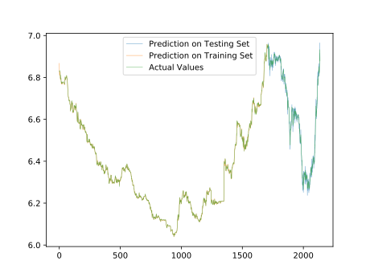

# Artificial Neural Networks & Economic Forecasting

## What's This?

This is my hello-world project on the intermixing field of economics and computer science.

This repository stores source codes for an interdisciplinary project involving computer science and economics. In this project, we deploy cutting-edge computer science techniques on economics-related topics. 

In this project, neural networks are built to make predictions on economic and financial data. Since those recurrent neural networks built are non-structural models, we could deploy those models with 

 Models are written in  `Keras` , `Tensorflow` and `Matlab`  libraries and corresponding data processing scripts can also be found in the same directory.

## Active Topics

### USD-CNY Exchange Rate Forecasting

#### Info.

Directory: `./k models/exchange/`

In this project,  `keras` based recurrent neural networks are built to make prediction on USD-CNY exchange rate (<u>Noon buying rates in New York City for cable transfers payable in foreign currencies)</u> using daily-frequency data. 

#### Uni-Variate Version (in progress)

The baseline model takes historical time series data of exchange rate and make single or multiple step forecasting.

#### Multi-Variate Version (in progress)

In additional to the baseline model, we extra time series are fed to the neural networks. The multi-variate version takes longer to be trained but can achieve higher accuracy.

#### Data Citation

Board of Governors of the Federal Reserve System (US), China / U.S. Foreign Exchange Rate [DEXCHUS], retrieved from FRED, Federal Reserve Bank of St. Louis; https://fred.stlouisfed.org/series/DEXCHUS, August 30, 2018.

#### Univariate Single Step Prediction Result

## Archived Topics

Archived codes can be found at `./archived/`

* `./archived/what's this/`  This folder contains all my draft codes and will not be used anymore. I don't know what's exactly in that, some of them may work some may not.

* `./archived/alpha/`  is a `tensorflow` based model to forecast macroeconomic indicators like price level and unemployment rate.
* `./archived/matlab code/`  is a `matlab`  based model for macroeconomic indicator forecasting.

## Reference

All reference papers and books could be found in Mendeley group [AnnEcon](https://www.mendeley.com/community/annecon/). 

## Database

* St. Louis Fed (FRED) Economic data by [Federal Reserve Bank of St. Louis](https://fred.stlouisfed.org)

* IMF DataMapper by [International Monetary Fund](http://www.imf.org/external/datamapper/datasets)

* [World Bank Open Data](https://data.worldbank.org)

